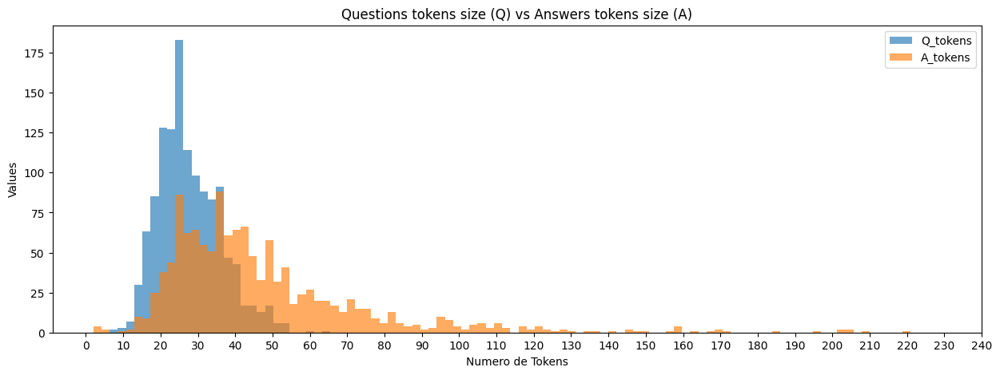

# Informe chatbot

# Dataset

## Intro

Para abordar a construção de um conjunto de dados de avaliação, foi utilizado o formato do Stanford Question Answering Dataset (SQuAD) [Rajpurkar et al. 2016]. Esse é um conjunto de dados com um formato bem definido para interpretação de texto e que facilita algumas métricas, como F1 e correspondências exatas.

Esse conjunto de dados contém cinco cabeçalhos principais: `id`, `title`, `context`, `question` e `answers`. Em particular, este último é composto por um dicionário no seguinte formato:

```jsx
{
	"text": [],
	"answer_started": []
}

```

Na chave `text`, são armazenados os resultados que servirão como Grand True.

## Mineração de contextos

Os contextos foram extraídos com base em parágrafos e nas seções próprias do documento. A estrutura do documento foi utilizada para gerá-los. Os nomes dos capítulos foram usados como títulos. Dentro disso, foram identificados os artigos, itens e seções do documento.

A seção do artigo foi processada individualmente, assim como cada ANEXO. Isso ocorreu porque cada anexo tinha uma estrutura específica.

Esse processo foi realizado utilizando a biblioteca `PyMuPDF` para extrair os textos e tabelas.

Vale ressaltar que partes do processo foram feitas manualmente, como alguns ajustes das tabelas que estavam contidas no documento.

Esse processo resultou em:

| Titulos | Contextos |
| --- | --- |
| 28 | 471 |

Em média, 16 contextos para cada título.

- Lista de títulos:
    - **título**
    - **Vagas e sistemas de ingresso à Graduação**
    - **Objetivo e características do Vestibular Unicamp**
    - **Sobre vagas oferecidas e as modalidades de classificação**
    - **Inscrição**
    - **Sobre as provas, notas e convocações**
    - **Matrículas**
    - **Sobre as prioridades nos sistemas de ingresso Unicamp**
    - **Disposições gerais**
    - **ANEXO I**
    - **ANEXO II - PROGRAMA DAS PROVAS**
    - **ANEXO II - REDAÇÃO, LÍNGUA PORTUGUESA E LITERATURAS DE LÍNGUA PORTUGUESA**
    - **ANEXO II - RELAÇÃO DE LIVROS**
    - **ANEXO II - MATEMÁTICA**
    - **ANEXO II - GEOGRAFIA**
    - **ANEXO II - HISTÓRIA**
    - **ANEXO II - SOCIOLOGIA**
    - **ANEXO II - FILOSOFIA**
    - **ANEXO II - LÍNGUA INGLESA**
    - **ANEXO II - CIÊNCIAS BIOLÓGICAS**
    - **ANEXO II - FÍSICA**
    - **ANEXO II - QUÍMICA**
    - **ANEXO II - PROVAS DE HABILIDADES ESPECÍFICAS**
    - **ANEXO III**
    - **ANEXO IV - Indicação de vagas e critérios para remanejamento de vagas no curso de Música**
    - **ANEXO V - Cursos de graduação por área de realização da prova do Vestibular Unicamp.**
    - **ANEXO VI - Candidatos(as) com deficiência ou em condições que exijam recursos específicos para realizar as provas do VU 2024**
    - **ANEXO VII - Redução Parcial da Taxa de Inscrição do VU 2024**

## Anotações

### Prompt

As anotações foram feitas a partir de solicitações ao chatGPT3.5 usando o seguinte prompt de controle para a entrada usando técnicas de **Few Shot Prompting.**

Foi projetado um prompt que continha:

1. Especificação do `role` do sistema:
    - `Você é um anotador de dados.`
2. Instruções sobre a tarefa que deveria ser cumprida:
    - `Dado um contexto, o anotador deve fornecer três perguntas e três respostas para cada pergunta.`
3. Parâmetros de como a resposta deveria ser:
    - `As perguntas devem esclarecer possíveis dúvidas de um usuário sobre esse contexto.`
    - `As respostas devem solucionar a pergunta usando o mesmo contexto.`
    - `As respostas devem estar contidas no contexto.`
    - `As respostas devem ser sucintas.`
    - `As respostas devem ser três para a mesma pergunta, onde:`
        - `a primeira deve ser simples e dar solução na pergunta sem muito argumento,`
        - `a segunda deve ter um argumento melhor` e
        - `a terceira resposta deve ser mais completa.`
4. Um exemplo aleatório extraído do FaQuAD, um conjunto de dados da língua portuguesa inspirado no SQuAD que contém perguntas e respostas de documentos da Universidade Federal de Mato Grosso do Sul (UFMS). E com o formato que queríamos na saída.

O prompt ficou da seguinte forma:

```python
"""
	Você é um anotador de dados.
	Dado um contexto o anotador deve fornecer três perguntas e três respostas para cada pergunta.
	As perguntas devem esclareçam possíveis dúvidas de um usuário sobre esse contexto.
	As respostas devem solucionar a pergunta usando o mesmo contexto.
	As respostas devem estar contida no contexto.
	As respostas devem ser sucintas.
	As respostas devem ser três para a mesma pergunta, onde:
	    a primeira deve ser simples y dar solução na pergunta sim muito argumento,
	    a segunda deve ter um argumento melhor e
	    a terceira resposta deve ser mais completa.
	
	exemplo:
	    contexto: Em muitas instituições, o TCC é encarado como critério final de avaliação do aluno: em caso de reprovação, o aluno estará impedido de obter o diploma e consequentemente exercer a respectiva profissão até que seja aprovado. O escopo e o formato do TCC (assim como sua própria nomenclatura) variam entre os diversos cursos e entre diferentes instituições, mas na estrutura curricular brasileira ela possui papel de destaque: em cursos ligados às ciências, normalmente é um trabalho que envolve pesquisa experimental, em cursos de caráter profissional, normalmente envolve: pesquisa bibliográfica e/ou empírica, a execução em si e uma apresentação de um projeto perante uma banca examinadora entre 3 e 5 professores (não necessariamente com Mestre ou Doutor). A banca examinadora formada para tal propósito não cria nenhuma expectativa de originalidade. Portanto, pode ser uma compilação (e não cópia) de outros ensaios com uma finalidade, um fio condutor, ou algo que forneça um roteiro, uma continuidade.
	    anotaição: 
	    ```
	      {
	          "perguntas": {
	              "p0": "O que acontece se o aluno reprovar no TCC?",
	              "p1": "Como o TCC é compreendida em instituições?",
	              "p2": "Quantos professores compõem a banca examinadora?"
	          }
	          "respostas": {
	              "p0": {
	                  "r0" : "o aluno estará impedido de obter o diploma",
	                  "r1" : "estará impedido de obter o diploma e consequentemente exercer a respectiva profissão",
	                  "r2" : "estará impedido de obter o diploma",
	                  }
	              "p1": {
	                  "r0" : "como critério final de avaliação do aluno",
	                  "r1" : "como critério final de avaliação do aluno",
	                  "r2" : "como critério final de avaliação do aluno",
	                  }
	                  
	              "p2": {
	                  "r0" : "entre 3 e 5",
	                  "r1" : "entre 3 e 5 professores",
	                  "r2" : "entre 3 e 5 professores (não necessariamente com Mestre ou Doutor)",
	                  }
	          }
	      }
	    ```
"""
```

### Resultado dos prompts

Ao finalizar este processo, foram obtidas 471 respostas do modelo, que estavam em formato de texto, porém não no formato necessário. Em alguns casos, as respostas estavam incompletas e esses resultados foram removidos.

### Limpeza

Os resultados que não atendiam às expectativas foram eliminados, geralmente eram resultados incompletos. Também foram removidos do conjunto de dados alguns resultados que continham perguntas que levavam o modelo a fornecer respostas com informações que não estavam no contexto. A seguir, é fornecido um exemplo disso:

```python
Titulo:
		ANEXO II - QUÍMICA

Contexto:
		"Eletroquímica 
		1ªF/2ªF - Processos de oxidação e redução – equacionamento, número de oxidação e identificação de espécies redutoras e oxidantes. 
		1ªF/2ªF - Aplicação da tabela de potenciais padrão de eletrodo, pilhas. 
		1ªF/2ªF - Leis de Faraday. 
		1ªF/2ªF - Eletrólise de soluções aquosas e de compostos fundidos."

Resposta do modelo:
,"{
  ""perguntas"": {
    ""p0"": ""O que são processos de oxidação e redução?"",
    ""p1"": ""Para que serve a tabela de potenciais padrão de eletrodo?"",
    ""p2"": ""O que são as leis de Faraday?"",
    ""p3"": ""O que acontece na eletrólise de soluções aquosas e de compostos fundidos?""
  },
  ""respostas"": {
    ""p0"": {
      ""r0"": ""Processos de oxidação são aqueles em que ocorre perda de elétrons por uma espécie química, resultando no aumento do número de oxidação. Processos de redução são aqueles em que ocorre ganho de elétrons por uma espécie química, resultando na diminuição do número de oxidação."",
      ""r1"": ""Processos de oxidação são aqueles em que ocorre perda de elétrons por uma espécie química, resultando no aumento do número de oxidação. Processos de redução são aqueles em que ocorre ganho de elétrons por uma espécie química, resultando na diminuição do número de oxidação."",
      ""r2"": ""Processos de oxidação são aqueles em que ocorre perda de elétrons por uma espécie química, resultando no aumento do número de oxidação. Processos de redução são aqueles em que ocorre ganho de elétrons por uma espécie química, resultando na diminuição do número de oxidação.""
    },
    ""p1"": {
      ""r0"": ""A tabela de potenciais padrão de eletrodo é utilizada para prever qual espécie será oxidada e qual será reduzida em uma reação de oxirredução. Ela fornece os valores de potencial padrão para diversas reações de oxirredução e permite determinar se uma reação é espontânea ou não."",
      ""r1"": ""A tabela de potenciais padrão de eletrodo é utilizada para prever qual espécie será oxidada e qual será reduzida em uma reação de oxirredução. Ela fornece os valores de potencial padrão para diversas reações de oxirredução e permite determinar se uma reação é espontânea ou não."",
      ""r2"": ""A tabela de potenciais padrão de eletrodo é utilizada para prever qual espécie será oxidada e qual será reduzida em uma reação de oxirredução. Ela fornece os valores de potencial padrão para diversas reações de oxirredução e permite determinar se uma reação é espontânea ou não.""
    },
    ""p2"": {
      ""r0"": ""As leis de Faraday são leis que descrevem a relação entre a quantidade de substância que reage em uma eletrólise e a quantidade de carga elétrica envolvida. A primeira lei de Faraday estabelece que a quantidade de substância que é produzida ou consumida em uma eletrólise é diretamente proporcional à quantidade de carga elétrica que passa pelo circuito. A segunda lei de Faraday estabelece que a quantidade de substância produzida ou consumida em uma eletrólise é diretamente proporcional às massas molares das espécies envolvidas."",
      ""r1"": ""As leis de Faraday são leis que descrevem a relação entre a quantidade de substância que reage em uma eletrólise e a quantidade de carga elétrica envolvida. A primeira lei de Faraday estabelece que a quantidade de substância que é produzida ou consumida em uma eletrólise é diretamente proporcional à quantidade de carga elétrica que passa pelo circuito. A segunda lei de Faraday estabelece que a quantidade de substância produzida ou consumida em uma eletrólise é diretamente proporcional às massas molares das espécies envolvidas."",
      ""r2"": ""As leis de Faraday são leis que descrevem a relação entre a quantidade de substância que reage em uma eletrólise e a quantidade de carga elétrica envolvida. A primeira lei de Faraday estabelece que a quantidade de substância que é produzida ou consumida em uma eletrólise é diretamente proporcional à quantidade de carga elétrica que passa pelo circuito. A segunda lei de Faraday estabelece que a quantidade de substância produzida ou consumida em" 
```

Este tipo de dados foi gerado possivelmente devido ao limite de tokens de saída.

### Formatação

Para que fique compatível com o formato do SQuAD, temos que usar o comando `eval`, que nos retorna um dicionário com as chaves `perguntas` e `respostas`, como mostrado abaixo:

```
{
  ""perguntas"": {
    ""p0"": ""O que é o VU 2024?"",
    ""p1"": ""Quais são as regras específicas estabelecidas?"",
    ""p2"": ""Essas regras são aplicáveis apenas para o Vestibular Unicamp de 2024?""
  },
  ""respostas"": {
    ""p0"": {
      ""r0"": ""O VU 2024 é o Vestibular Unicamp específico para o ano de 2024"",
      ""r1"": ""É o Vestibular Unicamp do ano de 2024"",
      ""r2"": ""É o processo seletivo da Unicamp para ingresso em 2024""
    },
    ""p1"": {
      ""r0"": ""As regras específicas estabelecem as normas para o processo seletivo do VU 2024"",
      ""r1"": ""Estabelecem as regras para o Vestibular Unicamp de 2024"",
      ""r2"": ""Determinam as normas para a seleção dos candidatos no VU 2024""
    },
    ""p2"": {
      ""r0"": ""Sim, essas regras são aplicáveis somente para o Vestibular Unicamp de 2024"",
      ""r1"": ""As regras são válidas apenas para o Vestibular Unicamp de 2024"",
      ""r2"": ""Apenas o processo seletivo de 2024 seguirá essas regras especificadas""
    }
  }
}"
```

Isso nos permitirá separar mais facilmente, em seguida, tabulamos nossos dados individualmente. Na seção `Preprocess data` do arquivo `experiments/RAG_probe.ipynb`, encontraremos a implementação desse formato. Como resultado, teremos algo como:

| ID | Title | Context | Question | Answers |
| --- | --- | --- | --- | --- |
| 18 | Vagas e sistemas de ingresso à Graduação | Art. 2º A presente Resolução especifica as regras para o VU 2024. | O que é o VU 2024? | {'text': ['O VU 2024 é o Vestibular Unicamp específico para o ano de 2024', 'É o Vestibular Unicamp do ano de 2024', 'É o processo seletivo da Unicamp para ingresso em 2024'], 'answer_start': []}  |
| 19 | Vagas e sistemas de ingresso à Graduação | Art. 2º A presente Resolução especifica as regras para o VU 2024. | Quais são as regras específicas estabelecidas? | {'text': ['As regras específicas estabelecem as normas para o processo seletivo do VU 2024', 'Estabelecem as regras para o Vestibular Unicamp de 2024', 'Determinam as normas para a seleção dos candidatos no VU 2024'], 'answer_start': []} |
| 20 | Vagas e sistemas de ingresso à Graduação | Art. 2º A presente Resolução especifica as regras para o VU 2024. | Essas regras são aplicáveis apenas para o Vestibular Unicamp de 2024? | {'text': ['Sim, essas regras são aplicáveis somente para o Vestibular Unicamp de 2024', 'As regras são válidas apenas para o Vestibular Unicamp de 2024', 'Apenas o processo seletivo de 2024 seguirá essas regras especificadas'], 'answer_start': []} |

Observe que os contextos foram duplicados para cada pergunta, mas um dicionário com todas as possíveis respostas foi mantido. Este formato nos ajudará posteriormente a calcular nossa métrica.

## Resultados do conjunto de dados

**Quantidade de dados:**

No final, concluímos o conjunto de dados com as seguintes quantidades de dados:

| Context Data | Data raw | UVQuAD |
| --- | --- | --- |
| 471 | 422 | 1270 |

Onde,

`Context Data:` Conjunto de dados inicial dos contextos.

`Data raw:` Conjunto de dados com as solicitações feitas ao ChatGPT.

`UVQuAD:` Conjunto de dados final.

**Distribuição de tokens em Perguntas vs Respostas:**

A seguir, vemos como as quantidades de tokens são distribuídas entre `Perguntas` e `Respostas`:

**Distribuição de tokens em Perguntas vs Respostas:**

A seguir, vemos como as quantidades de tokens são distribuídas entre `Quetions` vs `Answers`: 



Podemos afirmar que a maioria dos tokens usados nas perguntas está entre 12 e 40 tokens. Em relação às respostas, obtemos respostas entre 12 e 60 tokens.

# Usando RAG

Para la implementacion de RAG

# Metricas

# Resultados

# Referencias

```
@article{2016arXiv160605250R,
       author = {{Rajpurkar}, Pranav and {Zhang}, Jian and {Lopyrev},
                 Konstantin and {Liang}, Percy},
        title = "{SQuAD: 100,000+ Questions for Machine Comprehension of Text}",
      journal = {arXiv e-prints},
         year = 2016,
          eid = {arXiv:1606.05250},
        pages = {arXiv:1606.05250},
archivePrefix = {arXiv},
       eprint = {1606.05250},
}
```

```
@article{10.1109/BRACIS.2019.00084,
			 author = {Sayama,Hélio Fonseca and Araujo,Anderson Viçoso and Fernandes,
								 Eraldo Rezende},
		booktitle = {2019 8th Brazilian Conference on Intelligent Systems (BRACIS)},
				title = {FaQuAD: Reading Comprehension Dataset in the Domain of
								 Brazilian Higher Education},
			   year = {2019},
				pages = {443-448},
				  doi = {10.1109/BRACIS.2019.00084}}
```